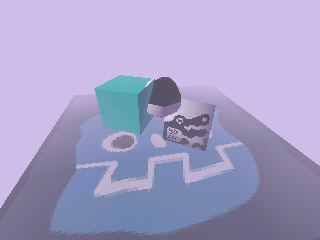

<h1 align="center">Godot <code>psxlike</code></h1>

  
  
  Accurate PS1 rendering for Godot 4+

Read the article explaining the approach: 

Notable Features:
- Accurate vertex snapping 
- Custom lighting system
- Flat triangle depth buffer
- Affine Texture Mapping
- Accurate and granular (per-model) dither
- Color modulation fog and Silent Hill style fog

## Usage

1. Clone the repo
2. Copy the `addons/psxlike` folder to your `addons` folder
3. Enable the plugin in Project Settings
